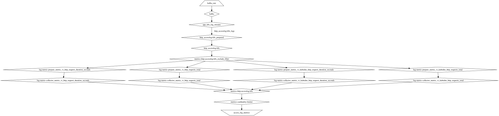

# Преобразование логов http accesslog в метрики с vector.dev

В данном каталоге лежат файлы описывающий подход, позволяющий генерировать [метрики из логов](https://vector.dev/docs/reference/configuration/transforms/log_to_metric/) без переписывания кода трансформов [vector.dev](https://vector.dev/) под каждый сервис.

**Описание:**

1. Полагаемся на то, что все сервисы пишут логи в фиксированном формате JSON и имеют одинаковый набор обязательных полей. См. [example_logs]
2. Для кодогенерации использован Ansible и jinja2 шаблоны. Генерируем toml файлы конфигурации vector.dev и тесты к ним, где нужно.
3. Метрики определяются в файле [ansible-playbook/vars/metrics-catalog.<env>.yml], после этого запускаем генерацию через ansible. См пример в Makefile. По умолчанию генерируется для `env=testing`, чтобы генерировать для production запускать `VECTOR_ENV=production make <команда>`
4. Отдельной задачей конфигурации выгружаются на серверы с агрегаторами vector.dev, и для применения новой конфигурации выполняется перезапуск процесса vector (здесь не приведены).

## Как было раньше

Каждый раз под новый источник мы писали новый код VRL, часто делая copy/paste с незначительными правками. Это могло занимать с отладкой и тестами весь рабочий день.
Потому в 2023 нас это перестало устраивать и мы придумали это подход. Подробно читайте https://habr.com/ru/articles/809801/ и https://habr.com/ru/articles/864614/.

## Что нам дал рефакторинг

* Мы вместо 5 часов теперь тратим 10-30 минут на добавление/изменение метрик с учетом выкатки на прод
* Появилась автоматическая валидация по схеме, теперь ошибку при описании метрки допустить сложнее
* Теперь для добавления новой метрки не нужно знать как это закодировать на языке VRL - достаточно YAML девелопера )

## Ограничения

Данный код является ознакомительным и не представляет собой готовое решение, вы можете придумать свое на основе данных идей.
Потому мы не приводим полные конфигурации vector.dev, код развертывания и полный набор ansible файлов для playbook.
Однако вы можете сгенерировать по файлу [ansible-playbook/vars/metrics-catalog.<env>.yml] файлы конфигурации vector и посмотреть как они выглядят.

## Генерирование файлов конфигурации

1. Используйте Ubuntu Linux (или Debian)
2. Запустите `make install-dependencies` и `make install-dev-dependencies`
3. Запустите `make download-vector-bin` - установить файлы vector для валидации запуска тестов
3. Метрики определяются в файле [ansible-playbook/vars/metrics-catalog.<env>.yml], после этого запускаем генерацию через ansible. См пример в Makefile. По умолчанию генерируется для `env=testing`, чтобы генерировать для production запускать `VECTOR_ENV=production make <команда>`
4. Выполните сборку и тесты `VECTOR_ENV=<env> make test-vector-transforms`, если не указать VECTOR_ENV, то используется `VECTOR_ENV=testing`
5. Созданные файлы смотрите в каталоге [.generated/vector_config]

## Граф компонентов vector.dev

В приведенной конфигурации создается следующий граф компонентов:

## Как писать фильтры в metric-catalog.yml правлиьно

* При описании указывайте фильтры по полям с наименьшим количеством значений и сравниваемых через простое сравнение без регулярных выражений - это улучшит производительнсоть обработки.
* В последнию очередь добавляйте условия с регулярными выржениями re/nre, т.к. чем позже они в выражении, тем больше шанс, что простые условия отсеят событие раньше.
* Старайтесь всегда сначала обходиться простыми условиями, и лишь при невозможности их применения переходить на условия с регулярными выржениями re/nre.

Пример более тяжелого для вычисления фильтра (плохой пример):

        - selector: Исключаем из метрик логи канарееченого релиза, которые получен для запросов из внутренней сети. Чтобы это не попадало SLO
          filter:
            service_name:
                re: "^.*-canary(-.*)?$"
            namespace:
                re: ".*-production"
            is_internal_traffic:
                eq: "1"

Тот же фильтр с измененным порядокм полей будет вычисляться быстрее (хороший пример):

        - selector: Исключаем из метрик логи канарееченого релиза, которые получен для запросов из внутренней сети. Чтобы это не попадало SLO
          filter:
            is_internal_traffic:  # << поставили на первое место простой фильтр
                eq: "1"
            namespace:
                re: ".*-production"
            service_name:
                re: "^.*-canary(-.*)?$"

## Контакты

Если вам интересны подробности вы можете писать нам, см. сайт https://vitech.team/ ("По вопросам сотрудничества") или приходите работать к нам.

Или https://github.com/r3code
